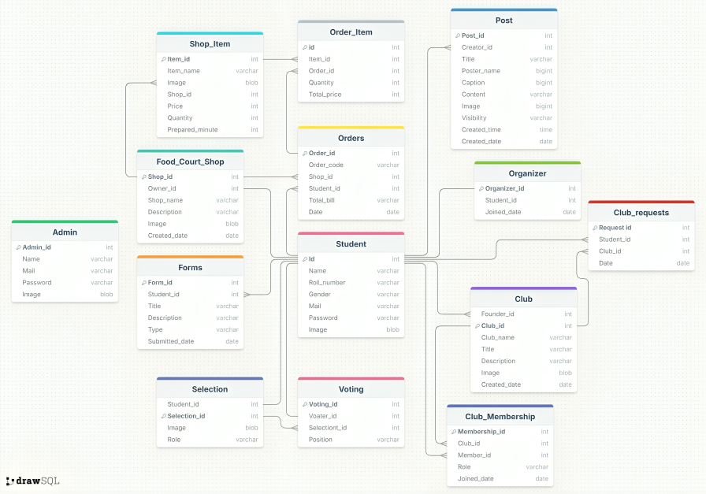

# UIT Student Activity Management Syatem 💻
This project is about the activity managements of the university students, like club and event activities.

## System Demo 🤖 

Authentication 👨‍💼:
         Students can only log in with the mail      provided by the university.

User roles:

        1.Admin 
        2.Organizer 
        3.Normal student
        4.Club founder
        5.Club members
        6.Food court shop owner

1.Admin:
         
🪼 Manage student data - Accept/Reject club requests - Add/Remove organizers -Posting

2.Organizer: 

💡 Accept/Reject food court shop requests - Manage events - Manage selections and voating - Posting

3.Normal student: 

🕯️ Creating club - Estiblish food court shop - Participate in certain events

4.Club founder: 

🎲 Manage club activity - Manage club members - Posting about clubs

5.Club members: 

🍁 Particiate in club activities - View Club private posts

6.Food court shop owner: 

🍿 Manage shop(item inventory : add/remove item - update item(name, price,..) -Manage orders - Posting about shops

## Used languages 🍵

Frontend  : React Js

Backend  : java,Spring boot

Database : Mysql

## Database 🗂️

